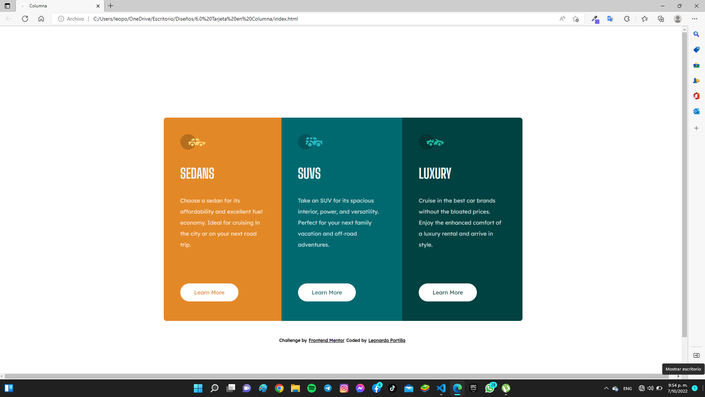
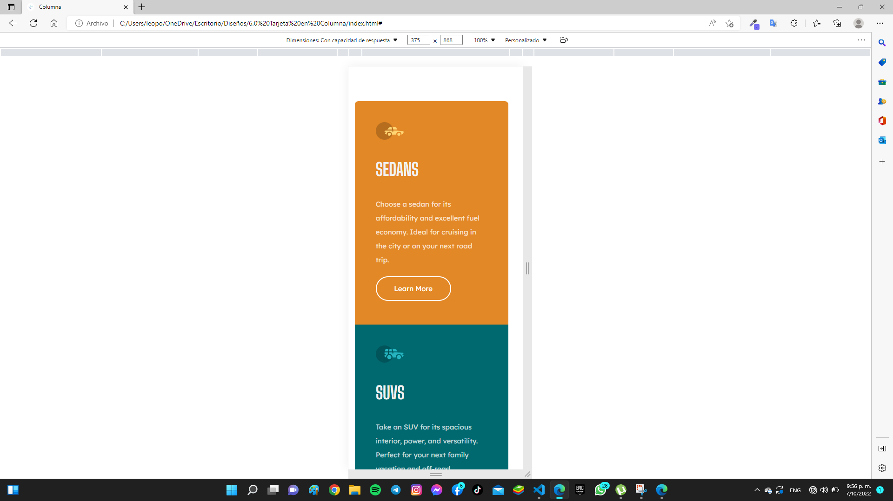
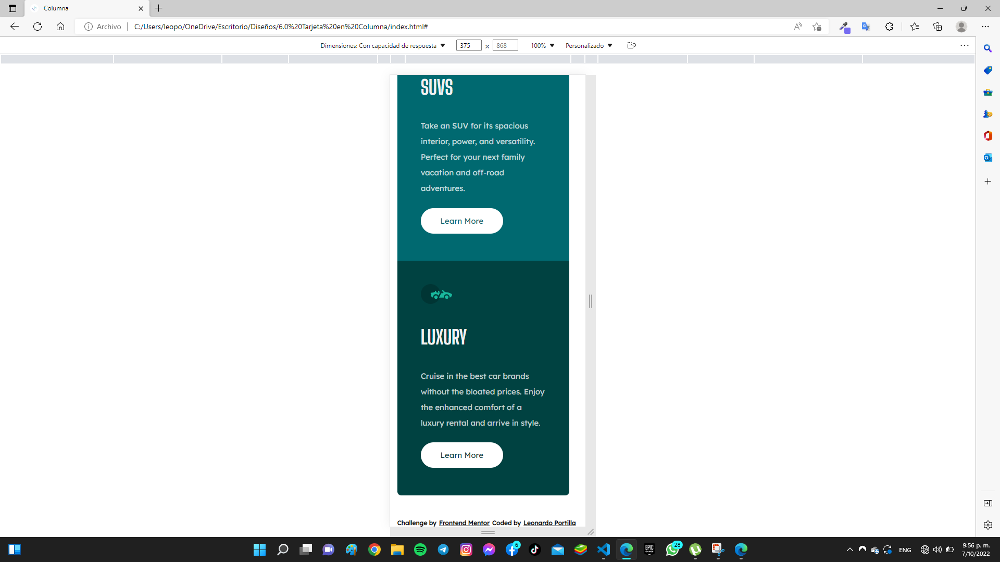

# Frontend Mentor - 3-column preview card component solution

### The challenge

Users should be able to:

- View the optimal layout depending on their device's screen size
- See hover states for interactive elements

### Screenshot

### Built with

- Semantic HTML5 markup
- CSS custom properties
- Flexbox
- CSS Grid
- Mobile-first workflow

## Author
- Git Hud - [Leonardo Portilla](https://github.com/leooportilla)
- Frontend Mentor - [@leooportilla](https://www.frontendmentor.io/profile/leooportilla) 